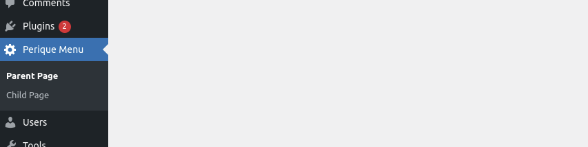
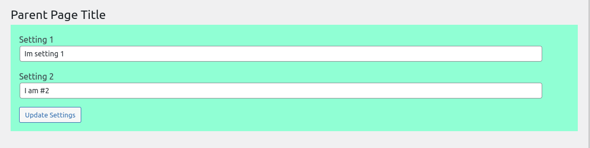
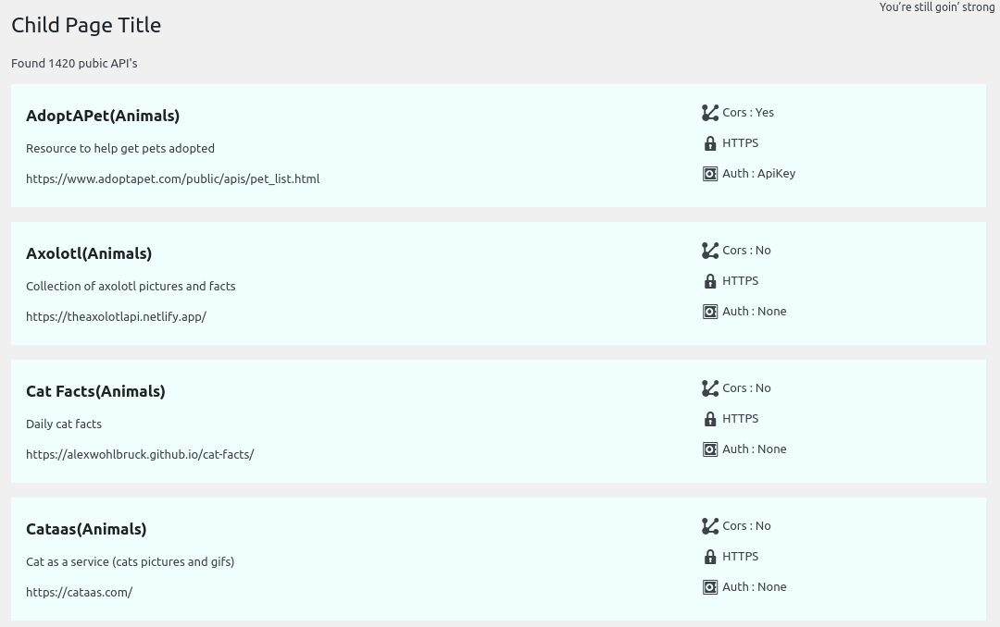

# Perique Menu Page Example

This is a simple plugin created using the `PinkCrab Perique Framework` . It show cases the `Perique_Admin_Menu` module, which makes it easy to create Pages and Page Groups. All through the DI Container allowing you to keep your domains separated and testable.

> [**Perique_Admin_Menu on Github**](https://github.com/Pink-Crab/Perique_Admin_Menu)

## Setup

If you would like to see this plugin in action, please clone the repository to a WordPress sites plugins directory (wp-content/plugins) and run `composer install --no-dev -o` from the command line.

## How it works

> For more details on bootstrapping Perique, please visit [perique.info](https://perique.info)

### Perique Bootstrapping

```php
// file perique-menu-page.php (plugin entry file)
require_once __DIR__ . '/vendor/autoload.php';

// Boot a barebones version of perique
$app = ( new App_Factory() )
  // Perique bootstrap as normal. 
  ->di_rules([
    '*' => ['substitutions' => 
      [Renderable::class => new PHP_Engine __DIR__ . '/views' )] 
    ],
  ])    
  ->construct_registration_middleware( Page_Middleware::class )
  ->registration_classes([ Menu_Page_Group::class ])
  ->boot();
```

Perique is bootstrapped as normal. The base view path is defined `/views` in this example (not shown here)
* We then define the `Page_Middleware`, this allow the use of `Page` and `Group` objects to be registered via the [**Registration Process**](https://perique.info/core/Registration/) at boot time. This added using `construct_registration_middleware`, so all middleware dependencies are injected by the [DI Container](https://perique.info/core/DI)
* The `Menu_Page_Group` class is added to the list of [Registration Classes](https://perique.info/core/App/setup#configregistrationphp). This allows the group and its pages to be registered with WP_Admin and constructed via the DI Container with any dependencies injected.

### Menu Group



This created a group for our pages, unlike adding the page and sub pages manually, this allows for the parent group to have its own `menu_title` , independent to the primary page.

```php
class Menu_Page_Group extends Abstract_Group {

  /** The primary page of the group. */
  protected Page $primary_page = Parent_Page::class;

  /** The pages in the group. */
  protected array $pages = array( Parent_Page::class, Child_Page::class );

  /** The capability required to access the group. */
  protected string $capability = 'manage_options';

  /** The group ICON */
  protected string $icon = 'dashicons-admin-generic';

  /** The menu groups position.*/
  protected int $position = 65;

  /** Access to the App_Config for paths.  */
  private App_Config $app_config;

  /** Is constructed using the DI Container */
  public function __construct( Translations $translations, App_Config $app_config ) {
    // Define the group title from the injected TRANSLATIONS service.
    $this->group_title = $translations->get_menu_group_title();

    // Set app config for path access
    $this->app_config = $app_config;
  }

  /** Enqueues the page css file with all pages. */
  public function enqueue( Abstract_Group $group, Page $page ): void {
    // Enqueue the custom page assets.
    \wp_enqueue_style(
      'perique-menu-example-primary-page-style',
      $this->app_config->url( 'assets' ) . 'perique-page.css',
      array(),
      $this->app_config->version()
    );
  }
}
```

* Above the register the 2 pages `Parent_Page` & `Child_Page` , with the `Parent_Page`, as the parent.
* The group title which we get from the `Translations` service. This is injected in at runtime. (Any of the Group properties, can be populated in `__construct` or defined as literal property values.)
* A shared CSS file is added for all Pages using the `enqueue()` method. This makes use of `App_Config` which we inject in via the DI Container for access to `Asset` paths.

> While not included here, there is also a `public function load( Abstract_Group $group, Page $page ): void` method, that allows for shared `on-load` actions. These are fired before the page loads.

## Pages

As defined in the `Menu_Page_Group` object, this group contains 2 pages. As with the group, these are constructed via the [DI Container](https://perique.info/core/DI), so can be injected with services.

### Parent_Page \[Model\]
This acts as our primary page for the group, clicking either the group title or the page in the sub menu will access the page.

> In this example we are using the `load(Page $page): void` to trigger the form handling when the settings form is submitted. We also inject the Plugin_Settings service, to allow for accessing the settings values in the view.

```php
class Parent_Page extends Menu_Page {
  /** The pages menu slug */
  protected $page_slug = 'perique_parent_page';

  /** The template to be rendered */
  protected $view_template = 'parent-page';

  /** Parent Form Handler */
  protected Parent_Page_Form_Handler $form_handler;

  public function __construct(
    Translations $translations,
    Parent_Page_Settings $settings_service,
    Parent_Page_Form_Handler $form_handler
  ) {
    // Set the title using the translations service.
    $this->menu_title = $translations->get_parent_menu_title();
    $this->page_title = $translations->get_parent_page_title();

    // Handles the form submission.
    $this->form_handler = $form_handler;

    // Populate the view data.
    $this->view_data = array(
      'settings'     => $settings_service,
      'nonce'        => \wp_create_nonce( Parent_Page_Form_Handler::PARENT_PAGE_FORM_NONCE ),
      'translations' => $translations,
      'page'         => $this,
    );
  }

  /** Runs the form handler before the page is loaded. */
  public function load( Page $page ): void {
    $this->form_handler->run();
  }
}
```
* The page and menu titles are populated via the `Translations` service, this allows for reusing of common strings and i18n translations.
* Both the `Parent_Page_Settings` for accessing settings and `Parent_Page_Form_Handler` for handling form submissions are injected via the DI Container (with `Translations`)
* The template path is added as just `parent-page`, this is resolved as `plugins/Perique_Menu_Page/views/` thanks to `[Renderable::class => new PHP_Engine __DIR__ . '/views' )]` defining(in plugin entry file) the base path for views in the `views` dir
* The view_data is populated in the constructor, these params are passed through to the 'view_template' for parsing.

### Parent_Page \[View\]
This acts as our primary page for the group, clicking either the group title or the page in the sub menu will access the page.



```php
<div class="wrap">
  <h2><?php echo $translations->get_parent_page_title(); ?></h2>
  <div id="primary_page_settings_form">
    <form action="" method="post">
      <input type="hidden" name="primary_page_nonce" value="<?php echo \esc_html( $nonce ); ?>">
      <div class="form-field">
        <label for="setting_1">
          Setting 1
          <input type="text" name="setting_1" id="setting_1" 
            value="<?php echo $settings->get_setting_1(); ?>">
        </label>
      </div>
      <div class="form-field">
        <label for="setting_2">
          Setting 2
          <input type="text" name="setting_2" id="setting_2" 
            value="<?php echo $settings->get_setting_2(); ?>">
        </label>
      </div>
      <div class="form-field">
        <input class="button" type="submit" value="Update Settings">
      </div>
    </form>
  </div>
</div> 
```
* The template makes use of the `Translations` class to access the parent page title (`$page->page_title()` could also have been used)
* The nonce value is defined as part of the view data using `$nonce`, this allows for a simple and clean `echo` of it value.
* The setting values are fetched form the `Plugin_Settings` object, passed to the view as `$settings`
* In an ideal world, all labels and any other string would be handled by the `Translations` service also. Removing any string literals and magic numbers from the template.
* The templates css is provided by the shared CSS file enqueued at the [group level](#menu-group)

### Child_Page \[Model\]
Our child page makes use of an injected service to list a collection of Public Api's and there basic details. This makes use of a very basic service `Public_Api_Provider` which handles the HTTP call and failures.

```php
class Child_Page extends Menu_Page {
  /** The pages menu slug. */
  protected $page_slug = 'perique_child_page';

  /** The template to be rendered. */
  protected $view_template = 'child-page';

  public function __construct(
    Translations $translations,
    Public_Api_Provider $api_provider
  ) {
    // Set the title using the translations service.
    $this->menu_title = $translations->get_child_menu_title();
    $this->page_title = $translations->get_child_page_title();

    // Populate the view data.
    $this->view_data = array(
      'api_list'     => $api_provider->get_api_list(),
      'translations' => $translations,
      'page'         => $this,
    );
  }
}
```
* Like the [parent pages model](#parent_page-model), we make use of the `Translations` object to handle page and menu titles.
* The template path is added as just `child-page`, this is resolved as `plugins/Perique_Menu_Page/views/` thanks to `[Renderable::class => new PHP_Engine __DIR__ . '/views' )]` defining(in plugin entry file) the base path for views in the `views` dir
* The data from the API List is populated from the `Public_Api_Provider` which is injected. *`get_api_list()` could have been called inside the template, to avoid populating this every time WP is loaded. It could also be cached too if required*

### Child_Page \[View\]
The view for the child page, we make use of the `Renderable` objects `render()` method to break the templated in 2 sections. As with the parent page, we make use of the shared CSS defined in the Group.



```php
// child-page.php
<div class="wrap">
  <h2><?php echo $translations->get_child_page_title(); ?>
  </h2>
  <p>Found <?php echo (int) $api_list['count']; ?> pubic APIs</p>
  <?php foreach ( $api_list['entries'] as $key => $value ) : ?>
    <?php $this->render( 'public-api-row', array('key' => $key, 'row' => $value) ); ?>
  <?php endforeach; ?>
</div>
```
> `$this` gives us access to the current `Renderable` implementation, which allows for the use of `partial` templates. As seen in the foreach loop.

```php
// public-api-row.php
<div id="api-<?php echo \absint( $key ); ?>" class="api-item__container">
  <div class="api-item__details">
    <h3><?php echo \esc_html( $row['API'] ); ?><span>(<?php echo \esc_html( $row['Category'] ); ?>)</span></h3>
    <p><?php echo \esc_html( $row['Description'] ); ?></p>
    <p><?php echo \esc_url( $row['Link'] ); ?></p>
  </div>
  <div class="api-item__features">
    <?php
      printf(
        '<p class="api-item__feature cors"><span class="dashicons dashicons-rest-api"></span> Cors : %s </p>',
        \esc_html( ucfirst( $row['Cors'] ) ),
      );
    ?>
    <?php
      printf(
        '<p class="api-item__feature https"><span class="dashicons dashicons-%s"></span> %s </p>',
        true === $row['HTTPS'] ? 'lock' : 'unlock',
        true === $row['HTTPS'] ? 'HTTPS' : 'HTTP',
      );
    ?>
    <?php
      printf(
        '<p class="api-item__feature auth"><span class="dashicons dashicons-vault"></span> Auth : %s</p>',
        '' === $row['Auth'] ? 'None' : esc_html( ucfirst( $row['Auth'] ) ),
      );
    ?>
  </div>
</div>
```
For every iteration of the foreach loop this template is parsed with the passed data. 
> We have done all the formatting and simple logic in the template, this easily could be formatted using an intermediary service between Public_Api_Provider and the View.

***

If you would rather use BLADE templates over the base PHP_Engine, you can include the [BladeOne Provider](https://github.com/Pink-Crab/Perique-BladeOne-Provider) and make use Blade Templates for a cleaner template generation.
